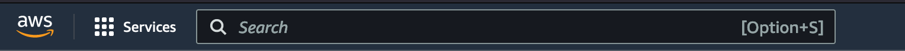

# Introduction

In this workshop, we will build a to-do application without needing any server to run. We will
use [AWS Lambda](https://aws.amazon.com/lambda/),
[Amazon API Gateway](https://aws.amazon.com/api-gateway/) and [Amazon DynamoDB](https://aws.amazon.com/dynamodb/).

## Installing NodeJS

AWS Lambda supports multiple languages by default, including Java, Python, Golang and many more. To keep the build
process
as simple as possible, we will use [Node.js](https://nodejs.org/en/) during this workshop. It does not require
compilation, and it is support by AWS Lambda by default.

To install Node.js, use can use one of the supported [package managers](https://nodejs.org/en/download/package-manager/)
or [download the installer](https://nodejs.org/en/#home-downloadhead).

```shell
# Install on Mac using Brew
brew install node

# Install on Ubuntu using Snap
sudo snap refresh node --channel=15

# Install on Windows using Chocolatey
cinst nodejs.install
```

## Accessing the AWS Console

Click [here](https://localhost ':id=console-link') to go to the AWS console. Log in with these credentials
[<span id=console-credentials></span>]

If you want to use the AWS CLI during the workshop, set the credentials in your shell.

!> These AWS Credentials are requested when you load the page. If the credentials don't show up, refresh this page.

### _CLI Credentials (Linux & Mac)_

```shell aws-cli-code-bash
export AWS_ACCESS_KEY_ID="ACCESS_KEY_PLACEHOLDER"
export AWS_SECRET_ACCESS_KEY="SECRET_KEY_PLACEHOLDER"
```

### _CLI Credentials (Windows)_

```powershell aws-cli-code-powershell
$Env:AWS_ACCESS_KEY_ID="ACCESS_KEY_PLACEHOLDER"
$Env:AWS_SECRET_ACCESS_KEY="SECRET_KEY_PLACEHOLDER"
```

# The AWS Console

## Regions and Availability Zones

AWS has the concept of a Region, which is a physical location around the world where we cluster data centers.
AWS provides a more extensive global footprint than any other cloud provider, and to support its global footprint and 
ensure customers are served across the world, AWS opens new Regions rapidly. AWS maintains multiple geographic Regions, 
including Regions in North America, South America, Europe, China, Asia Pacific, South Africa, and the Middle East.

For this workshop, we will use the `eu-west-1` region. It is a region close to us, which minimizes latency. It's also
one of the regions where new services are enabled faster than other regions. Change the current region in the top right
corner in the AWS Console.

## AWS Services

In the top left corner in the AWS Console, there's a searchbar and an overview of available services. AWS offers over
200 services, but in this workshop, we will focus on 3 of them: [AWS Lambda](https://aws.amazon.com/lambda/),
[Amazon API Gateway](https://aws.amazon.com/api-gateway/) and [Amazon DynamoDB](https://aws.amazon.com/dynamodb/).



# AWS Lambda

## What is Lambda?

AWS Lambda is a serverless, event-driven compute service that lets you run code for virtually any type of application 
or backend service without provisioning or managing servers.

## Creating your first Lambda

```javascript
exports.handler =  async function(event, context) {
    return {
        statusCode: 200,
        body: JSON.stringify({
            message: 'Hello from my Lambda Function.',
        }),
    }
}
```

# Amazon API Gateway

## What is API Gateway?

Amazon API Gateway is a fully managed service that makes it easy for developers to create, publish, maintain, monitor, 
and secure APIs at any scale. API Gateway handles all the tasks involved in accepting and processing up to hundreds of 
thousands of concurrent API calls, including traffic management, CORS support, authorization and access control, 
throttling, monitoring, and API version management.

## Exposing your first endpoint

# Amazon DynamoDB

## What is DynamoDB?

Amazon DynamoDB is a fully managed, serverless, key-value NoSQL database designed to run high-performance applications. 

# Let's build something

## The problem statement

Build a to-do application with following functionality:

- Create a to-do item
- Complete a to-do item

These are the steps I would take to build it:

- Create a new endpoint in API Gateway with a new Lambda Function as backend
  - The endpoint handles POST requests, so you can access `{title: string}` in the Lambda event.
- Store the new item in DynamoDB
  - Use the [DynamoDB::PutItem](https://docs.aws.amazon.com/sdk-for-javascript/v2/developer-guide/dynamodb-example-table-read-write.html) API.
- Create a new endpoint in API Gateway with a new Lambda Function as backend
  - The endpoint handles GET requests and returns a list of to-do items.
- Create a new endpoint which handles PUT requests to update the status in DynamoDB.