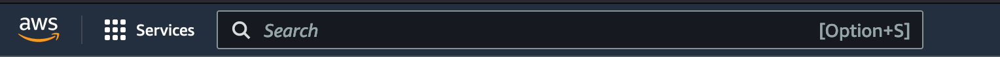

# Introduction

In this workshop, we will build a to-do application without needing any server to run. We will
use [AWS Lambda](https://aws.amazon.com/lambda/),
[Amazon API Gateway](https://aws.amazon.com/api-gateway/) and [Amazon DynamoDB](https://aws.amazon.com/dynamodb/).

## Accessing the AWS Console

Click [here](https://localhost ':id=console-link') to go to the AWS console. Log in with these credentials
[<span id=console-credentials></span>]

If you want to use the AWS CLI during the workshop, set the credentials in your shell.

!> These AWS Credentials are requested when you load the page. If the credentials don't show up, refresh this page.

# The AWS Console

## Regions and Availability Zones

AWS has the concept of a Region, which is a physical location around the world where we cluster data centers.
AWS provides a more extensive global footprint than any other cloud provider, and to support its global footprint and 
ensure customers are served across the world, AWS opens new Regions rapidly. AWS maintains multiple geographic Regions, 
including Regions in North America, South America, Europe, China, Asia Pacific, South Africa, and the Middle East.

For this workshop, we will use the `eu-west-1` region. It is a region close to us, which minimizes latency. It's also
one of the regions where new services are enabled faster than other regions. Change the current region in the top right
corner in the AWS Console.

## AWS Services

In the top left corner in the AWS Console, there's a searchbar and an overview of available services. AWS offers over
200 services, but in this workshop, we will focus on 3 of them: [AWS Lambda](https://aws.amazon.com/lambda/),
[Amazon API Gateway](https://aws.amazon.com/api-gateway/) and [Amazon DynamoDB](https://aws.amazon.com/dynamodb/).



# AWS Lambda

## What is Lambda?

AWS Lambda is a serverless, event-driven compute service that lets you run code for virtually any type of application 
or backend service without provisioning or managing servers.

## Creating your first Lambda

In the [Lambda Console](https://eu-west-1.console.aws.amazon.com/lambda/home?region=eu-west-1#/functions), use the <button class="orange-aws-button aws-button">Create function</button>
to create a new Lambda Function.

When creating a new Lambda Function, 3 properties are important: **Function name**, **Runtime** and **Execution role**.
For the function name, choose whatever you like, but make sure it is unique (e.g. your name). For the Lambda Runtime, 
we will be working with `Node.js 16.x`, all available runtimes are documented [here](https://docs.aws.amazon.com/lambda/latest/dg/lambda-runtimes.html).
For **Execution role**, use the `Use an existing role` option and select the `workshop-lambda-execution` role. [IAM](https://aws.amazon.com/iam/)
roles and policies are used to grant permissions to Users and Services on AWS. This role has permissions to start the 
Lambda and log the output to [AWS CloudWatch](https://aws.amazon.com/cloudwatch/).

<details>
  <summary>This is what it should look like!</summary>


</details>

After creating the Function, you can use the <button class="orange-aws-button aws-button">Test</button> button to execute your
Function. In the results from a test, you can see the response your Function returned and the logs it produced.

Now change the code to the following snippet, use the <button class="white-aws-button aws-button">Deploy</button> button to
update your code and test again. The response from your Function should have changed to reflect the new message.

```javascript
exports.handler =  async function(event, context) {
    return {
        statusCode: 200,
        body: JSON.stringify({
            message: 'Hello from my Lambda Function.',
        }),
    }
}
```

# Amazon API Gateway

## HTTP and REST

### What is HTTP ?

Quoted from [the Wikipedia page of HTTP](https://en.wikipedia.org/wiki/Hypertext_Transfer_Protocol#Technical_overview)

> HTTP functions as a request–response protocol in the client–server model. A web browser, for example, may be the 
> client whereas a process, named web server, running on a computer hosting one or more websites may be the server.

An HTTP request consists of 3 required parts: The request method, the URL and the protocol version

```shell
GET /images/logo.png HTTP/1.1
```

followed by zero or more request headers.

```shell
Host: www.example.com
Accept-Language: en
```

An HTTP response consists of 3 parts: The protocol version, the status code and the decsription of the status

```shell
HTTP/1.1 200 OK
```

followed by zero or more response headers

```shell
Content-Type: text/html
```

and an optional response body.

### What is REST ?

Quotes from the [RedHat explanation of REST](https://www.redhat.com/en/topics/api/what-is-a-rest-api#rest)

> REST is a set of architectural constraints, not a protocol or a standard. API developers can implement REST in a 
> variety of ways. When a client request is made via a RESTful API, it transfers a representation of the state of the 
> resource to the requester or endpoint. This information, or representation, is delivered in one of several formats 
> via HTTP: JSON (Javascript Object Notation), HTML, XLT, Python, PHP, or plain text. JSON is the most generally popular 
> file format to use because, despite its name, it’s language-agnostic, as well as readable by both humans and machines.


## What is API Gateway?

Amazon API Gateway is a fully managed service that makes it easy for developers to create, publish, maintain, monitor, 
and secure APIs at any scale. API Gateway handles all the tasks involved in accepting and processing up to hundreds of 
thousands of concurrent API calls, including traffic management, CORS support, authorization and access control, 
throttling, monitoring, and API version management.

## Exposing your first endpoint

In the Lambda Console, use the <button class="white-aws-button aws-button">+ Add Trigger</button> button to add API Gateway
as the trigger for the Lambda Function. As a Source, select `API Gateway` and pick `Create a new API`. When creating a 
type, you have the choice between [HTTP API and REST API](https://docs.aws.amazon.com/apigateway/latest/developerguide/http-api-vs-rest.html),
for this workshop, we can go with **HTTP API**. As Security configuration, choose **Open** as we don't mind that 
unauthenticated users can access the API. That's it, use the <button class="orange-aws-button aws-button">Add</button> button
to create the API Endpoint.

?> When creating API Endpoints using the Console, the default request method is _ANY_, so it accepts both _GET_ and _POST_ requests.

After the API is created, you can use the **API Endpoint** to call your Function using `curl` or [Postman](https://www.postman.com/).

```shell
curl https://09ntvi2i7h.execute-api.eu-west-1.amazonaws.com/default/robs-first-lambda-function
```


# Amazon DynamoDB

## What is DynamoDB?

Amazon DynamoDB is a fully managed, serverless, key-value NoSQL database designed to run high-performance applications.

## Using the DynamoDB SDK

We can use the [AWS SDK](https://docs.aws.amazon.com/AWSJavaScriptSDK/latest/AWS/DynamoDB.html) to interact with DynamoDB.
A table is already provisioned with the name `to-do-items`. Following code shows how to retrieve items from DynamoDB.
You can update your Lambda code to try it out. It uses the [Scan](https://docs.aws.amazon.com/AWSJavaScriptSDK/latest/AWS/DynamoDB.html#scan-property)
operation. You can use this in the solution later on, as well as the [PutItem](https://docs.aws.amazon.com/AWSJavaScriptSDK/latest/AWS/DynamoDB.html#putItem-property)
and the [UpdateItem](https://docs.aws.amazon.com/AWSJavaScriptSDK/latest/AWS/DynamoDB.html#updateItem-property) operation.

```javascript
const AWS = require('aws-sdk');
const dynamodb = new AWS.DynamoDB({apiVersion: '2012-08-10'});

exports.handler = async function (event, context) {
    const {Items: items} = await dynamodb.scan({TableName: 'to-do-items'}).promise();
    return {
        statusCode: 200,
        body: JSON.stringify({
            items: items.map(item => ({id: item.id.S, completed: item.completed.BOOL})),
        }),
    }
}
```

## View your items

In the [DynamoDB Console](https://eu-west-1.console.aws.amazon.com/dynamodbv2/home?region=eu-west-1#tables), there is an
overview of all tables in the selected region. When you select a table, for example `to-do-items`, use the
<button class="orange-aws-button aws-button">Explore table items</button> button to view all items in the table. By default,
this performs the same `Scan` operation as the code snippet above.

# Let's build something

## The problem statement

Build a to-do application with following functionality:

- Create a to-do item
- Complete a to-do item

These are the steps I would take to build it:

- Create a new endpoint in API Gateway with a new Lambda Function as backend
  - The endpoint handles POST requests, so you can access `{title: string}` in the Lambda event.
  - You can find an example of a HTTP API Event [here](https://github.com/awsdocs/aws-lambda-developer-guide/tree/main/sample-apps/nodejs-apig/event.json).
- Store the new item in DynamoDB
  - Use the [DynamoDB::PutItem](https://docs.aws.amazon.com/sdk-for-javascript/v2/developer-guide/dynamodb-example-table-read-write.html) API.
  - Store the Item as `{id: <auto-generated>, name: <title>, completed: false}` in DynamoDB using the `PutItem` operation.
- Create a new endpoint in API Gateway with a new Lambda Function as backend
  - The endpoint handles GET requests and returns a list of to-do items.
- Create a new endpoint which handles PUT requests to update the status in DynamoDB.